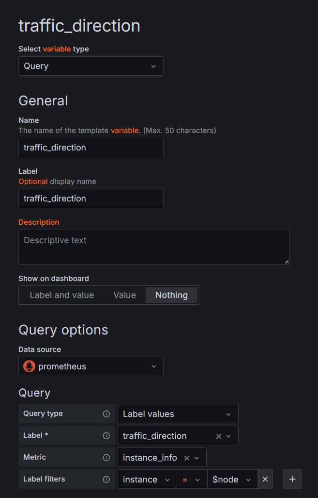
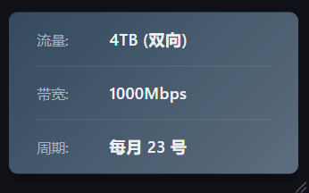

# 📊 NodeTrafficCalc

## 📝 项目简介

**NodeTrafficCalc** 是一个专为解决 Grafana + Prometheus + node_exporter 中不同实例有不同月流量重置日的问题而设计的工具。在原监控系统中，所有实例通常共享同一个流量统计周期，这无法满足不同实例服务商有不同计费周期的实际需求。本项目通过自定义计算和指标推送，使每个实例能够根据其特定的月重置日来计算和展示流量数据。


## ✨ 主要功能

- **🔧 灵活配置**：通过 YAML 配置文件进行设置，支持热重载
- **💻 仅需在主控端部署**：无需在每个被监控节点上安装额外组件
- **📆 自定义重置日期**：为每个实例单独配置月流量重置日
- **📊 多指标支持**：提供上传、下载和总流量三种指标


## 🚀 快速启动

###  1. 克隆仓库

```bash
git clone https://github.com/Heavrnl/NodeTrafficCalc
cd NodeTrafficCalc
```
###  2. 配置实例

编辑配置文件，在 instances 部分添加你的实例和对应的重置日，并配置你的Prometheus 服务器的 URL：
```bash
vi NodeTrafficCalc/config.yaml
```

### 3. 启动服务
```bash
docker-compose up -d
```

### 4. 配置 prometheus.yml
在scrape_configs中添加
```yaml
- job_name: 'pushgateway'
  scrape_interval: 10s
  honor_labels: true
  static_configs:
    - targets: ['localhost:9091']
```
 重启 prometheus


## 在 Grafana 中使用

### ⬆️ 上传流量：
```
instance_monthly_transmit_bytes_increase{job="monthly_traffic_calculator", instance=~"$node"}
```

### ⬇️ 下载流量：
```
instance_monthly_receive_bytes_increase{job="monthly_traffic_calculator", instance=~"$node"}
```

### 📊 总流量：
```
instance_monthly_total_bytes_increase{job="monthly_traffic_calculator", instance=~"$node"}
```

### 其他
```
instance_info{instance=~"$node"}
```


### 变量
在面板上的Settings里配置以下变量，参考图里的设置，你有多少个自定义标签，就添加多少个变量
```
reset_day
label_values(instance_info{instance="$node"},reset_day)	

traffic_direction
label_values(instance_info{instance="$node"},traffic_direction)	

bandwidth_limit
label_values(instance_info{instance="$node"},bandwidth_limit)	

monthly_limit
label_values(instance_info{instance="$node"},monthly_limit)
```

### 变量配置示例



示例：在Title里使用
```
当前月流量统计（每月 $reset_day 日重置）
```

### Text 面板 html
添加可视化，选择Text面板
```html
<div style="color: #dcdcdc; 
           padding: 13px 25px; 
           border-radius: 8px; 
           background: linear-gradient(135deg, #34495e 0%, #5d6d7e 100%); 
           box-shadow: 0 6px 18px rgba(0, 0, 0, 0.4); 
           width: 100%; 
           font-family: 'Segoe UI', 'Roboto', sans-serif; 
           margin: 10px 0; 
           position: relative;
           box-sizing: border-box;">
  
  <div style="padding-bottom: 12px; 
              margin-bottom: 12px; 
              border-bottom: 1px solid rgba(255, 255, 255, 0.1); 
              display: flex; 
              align-items: baseline; 
              line-height: 1.6;">
    <span style="font-weight: 500; 
               color: #a0b3c4; 
               margin-right: 10px; 
               flex-shrink: 0; 
               min-width: 55px; 
               font-size: 0.9em;">
      流量:
    </span>
    <span style="color: #f0f0f0; 
               font-weight: 600; 
               font-size: 1.05em; 
               word-break: break-word;">
      $monthly_limit ($traffic_direction)
    </span>
  </div>
  
  <div style="padding-bottom: 12px; 
              margin-bottom: 12px; 
              border-bottom: 1px solid rgba(255, 255, 255, 0.1); 
              display: flex; 
              align-items: baseline; 
              line-height: 1.6;">
    <span style="font-weight: 500; 
               color: #a0b3c4; 
               margin-right: 10px; 
               flex-shrink: 0; 
               min-width: 55px; 
               font-size: 0.9em;">
      带宽:
    </span>
    <span style="color: #f0f0f0; 
               font-weight: 600; 
               font-size: 1.05em; 
               word-break: break-word;">
      $bandwidth_limit
    </span>
  </div>
  
  <div style="/* 最后一行无下边框 */
              display: flex; 
              align-items: baseline; 
              line-height: 1.6;"> 
    <span style="font-weight: 500; 
               color: #a0b3c4; 
               margin-right: 10px; 
               flex-shrink: 0; 
               min-width: 55px; 
               font-size: 0.9em;">
      周期:
    </span>
    <span style="color: #f0f0f0; 
               font-weight: 600; 
               font-size: 1.05em; 
               word-break: break-word;">
      每月 $reset_day 号
    </span>
  </div>

</div>
```

## 示例图



